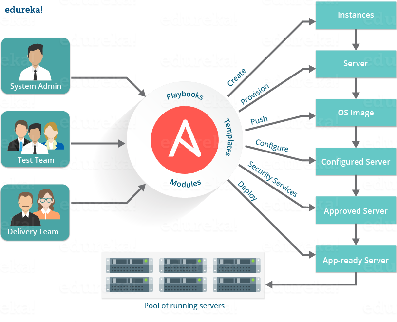
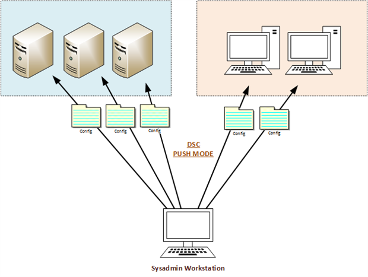

#Software Configuration Management and its implications in server infrastructure
 
### masters of software engineering
### mohamed feddad
### ID: 110025553

    

#### abstract:
Software Configuration Management (SCM), Is an over extensive field that branches into many different
fields of Information Technology. This paper attempts to brief its reader with different implications
of SCM and how to improves and influence each.

 

#### introduction:
From many fields to cover the influence of SCM on, Two were chosen to be covered extensively with practical review on the most prominent modern technologies in software configuration management in the fields of Servers infrastructure and Software data configuration.

In the practical sides of things, i chose to demonstrate and review the configuration management for server infrastructure with Ansible a configuration management tool that allow us to configure, deploy and maintain countless amount of severs asynchronously via standard technology, which's provided by default in majority of modern and legacy operating systems, SSH. The case study will be conducted as an attempt to review, the advantages and disadvantages of utilizing, such configuration  management system for the purposes of deploying, configuring and maintaining software.[1]     

 
The use diagram show case a simple Ansible infrastructure, and the interaction between the Users, in this case each user represented by a team or department, which traditionally are involved in a software deployment, configuration and maintenance. As shown, the users or teams are able to interact with the system independently from each actions or input, as long as the system has not yet lunch and execute its playbook or the states of configuration. Playbooks are the set of configuration files, that's written in YML files. Ansible reads the files and executes the set of configurations and instructions written in them. The execution of each file and set of configuration follows a certain hierarchy, which is layed out by the default Ansible files tree structure. [2]

As for the practical example and the infrastructure structure been followed. Limitation that been applied purposefully in order to over simplify the outcomes of the case study into the main points of deploy, configure and maintain exclusively. So the practical example won't include any of the operating system installation nor any of the testing stages. Therefore it assumes that you've already have both the OS and testing done beforehand.
    

#### methodology:
Case study based on deploying, configuring and maintaining a software via the software configuration management tool Ansible. the metrics of determining the advantages and disadvantages are solely based on time spent and effort committed in deploying, configuring and maintaining a software manually and with the assistance of Ansible the configuration management tool.

- Manually [3]     

  

Traditional manual approach to achieve, the goal of our study are well known and been reviewed countless times, Nevertheless for the purpose of further clarification. A typical deployment of a software to a server or the infrastructure, requires some form of a connection given that the development is not done on the deployment platform. Moreover a traditional semi-automated method to achieve this goal is typically and SSH connection that allows to read and write and possibly execute bash or shell scripts to run our configuration and maintenance. However such simple tasks have always been prone to redundancy or over complexity whenever faced with the challenge of deploying into multiple different environment, which usually require specific set of configuration written for each. With that complexity overhead add the complexity of sheer numbers. Deploying one application to two different environments require to set of configuration and two set of deployment scripts. However deploying 2 different applications will require double the amount and the multiplication continues with any added number of environments and applications.

With the layout of manual or traditional approach clarified, the overhead and redundancy that-which software configuration management tools attempt to solve is even more clearer. Not the structure on-which its application relaying is simplified via the use case diagram shown previously [1].

    

#### conclusion:
The results cam just as expected, an equivalent duration of time was spent in writing, the united configuration YML file that Ansible will run on the hosts and servers that we provide it with in the configuration. [3] However the unification of writing the configuration files in one format does reduce the time when compared to traditional approach of trying cover the specific details of if conditions to determine the current environment [4]. Moreover, reduction of 100% whenever we add another environment to add to our list of hosts to deploy, configure and maintain for. [5]

    

#### references:
`[1] Test Driven Development Definition (https://en.wikipedia.org/wiki/Ansible)`  
`[2] FQM - Free Queue Manager, open-source project (https://github.com/mrf345/SCM/ansible_stuff/)`  
`[3] List of hosts file used in the case study (https://github.com/mrf345/SCM/ansible_stuff/ansible_basics/hosts)`  
`[4] Example of unified configuration management file used (https://github.com/mrf345/SCM/ansible_stuff/ansible_basics/site.yml)`  
`[5] Example of the detailed configuration files (https://github.com/mrf345/SCM/ansible_stuff/ansible_basics/roles)`  